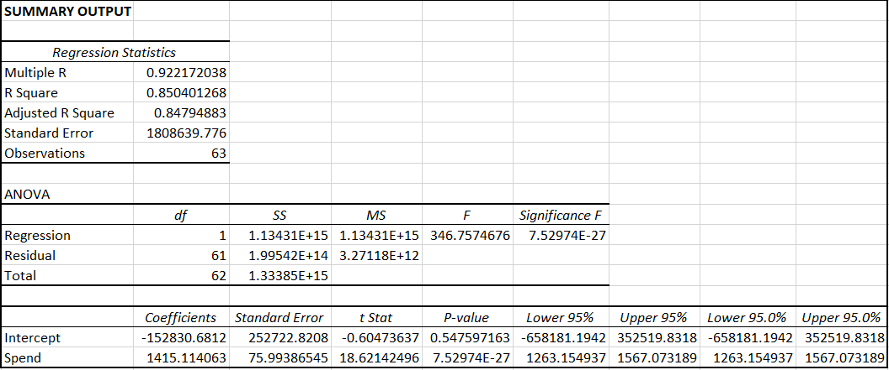

# Comparing Political Snapchat Data (RunTime & Spending's Impact on Impressions) Among Candidates and Year
Is the effect of RunTime on Impressions always statistically insignificant and, additionally, is spending more impactful for specific candidates?

Firstly, I decided to create linear regression models using open data on Snapchat political advertisements. For the first part, I created linear regression models using 2020 data for the following candidates: Trump, Pete, Warren, Biden, and Bloomberg. I took the Spending data given and created the variable(RunTime) by subtracting EndDate by StartDate, however this variable was only applicable to Pete, Bloomberg, Warren, and Biden, however, the latter two (Warren and Biden) had too limited political data for RunTime to be useful. Moreover, for the second part of my analysis, I decided to compare the linear regression models of a single advertiser over the three separate years of data given. Thus, I used the 2018, 2019, and 2020 Spending and RunTime data of Voto Latino. Voto Latino was chosen specifically because it marketed political advertisements over the course of all three years. 

# Part 1 - Political Candidates
 (Figure 1 - Linear Regression Model Comparing Spending and RunTime for Pete)

 (Figure 2 - Linear Regression Model Comparing Spending and RunTime for Bloomberg)

As seen by Figures 7 and 8 (shown at the end), there aren't enough data points to show that Spending is even stastically significant for Warren and Biden. Additionally, Trump, in Figure 6 (shown at the end), didn't have any EndDate's for his political ads (whether or not it may be that his ads are still running) so a RunTime could not be calculated. Spending for Trump was statistically significant, as suspected. Moreover, Figure 2 shows that RunTime is statistically insignificant for Bloomberg, however spending is and Figure 9 shows the correct regression model for Bloomberg. The most interesting result is that of Pete's linear regression model. Out of the 5 candidates, Figure 1 shows that RunTime is actually statistically significant. Figure 11 shows that alone, RunTime doesn't explain much of the data at all, however, finally, RunTime actually was statistically significant among a regression model alongside Spending. 

However, I also questioned whether spending is more impactful for specific candidates. So, using the proper linear regression models for each candidate (Figures 1, 6, 7, 8, 9), we can begin to compare the effects of spending. Beginning with Trump, the regression model fits about 85% of the data as taken from the r-squared value. With this in mind, the coefficient for spending is 1415, meaning for each dollar spent on political ads on Snapchat, Trump receives 1415 impressions. Pete's model fits about 95% of the data and he receives 418 impressions per dollar spent. Then, Bloomberg's model fits only 48% of the data and he only receives 243 impressions per dollar spent. Warren and Biden's models were statistically insignificant. Thus, it can be concluded that spending money on ads is most useful for Trump and the least useful for Bloomberg, with about a 1000 unit gap between Trump and Pete; additionally, it is concluded that the effect of RunTime on impressions does differ between political candidates.

# Part 2 - Years

 (Figure 3 - Linear Regression Model Comparing Spending and RunTime for Voto Latino 2020)

 (Figure 4 - Linear Regression Model Comparing Spending and RunTime for Voto Latino 2019)

 (Figure 5 - Linear Regression Model Comparing Spending and RunTime for Voto Latino 2018)

Alternatively, I wanted to see if the effect of RunTime on impressions differs yearly. In order to do compare this, I found Voto Latino, an advertiser that paid for advertisements from 2018-2020. The results of the regression models are shown above in Figures 3, 4, and 5. Something that was peculiar was that RunTime was statistically significant for two of the three years, with it being statistically insignificant in 2019, where Figure 10 shows the updated model for that. 

Something else that was peculiar was the effect that RunTime actually had on impressions in comparison to Pete's model from Part 1. Whereas increased RunTime caused an increase in impressions for Pete, the longer the RunTime for Voto Latino, the less impressions they received. Altogether, time is a variable that does appear to affect impressions with what little data I compared with Voto Latino. 

# Conclusion

In conclusion, RunTime appears to have multiple variables affecting its influence on impressions, the first being who the candidate of the political ad is. RunTime was insignificant for most candidates, except for Pete. In addition to this, time does appear to have some sort of effect on when RunTime does affect impressions, however more data is required to come to a true conclusion. Finally, among the 5 candidates, the effect of Spending on impressions differed greatly; with it being the most effective for Trump, then Pete, and, lastly Bloomberg (with spending being statistically insignificant for Warren and Biden).

# Figures
 (Figure 6 - Linear Regression Model Comparing Spending for Trump)
 (Figure 7 - Linear Regression Model Comparing Spending for Warren)
 (Figure 8 - Linear Regression Model Comparing Spending for Biden)
 (Figure 9 - Linear Regression Model Comparing Spending for Bloomberg)
 (Figure 10 - Linear Regression Model Comparing Spending for Voto Latino 2019)
 (Figure 11 - Scatter Plot with Trendline for RunTime and Impressions for Pete)

# Links

[Excel - Data](Data.xlsx)

[Data Sets](https://www.snap.com/en-US/political-ads/)
